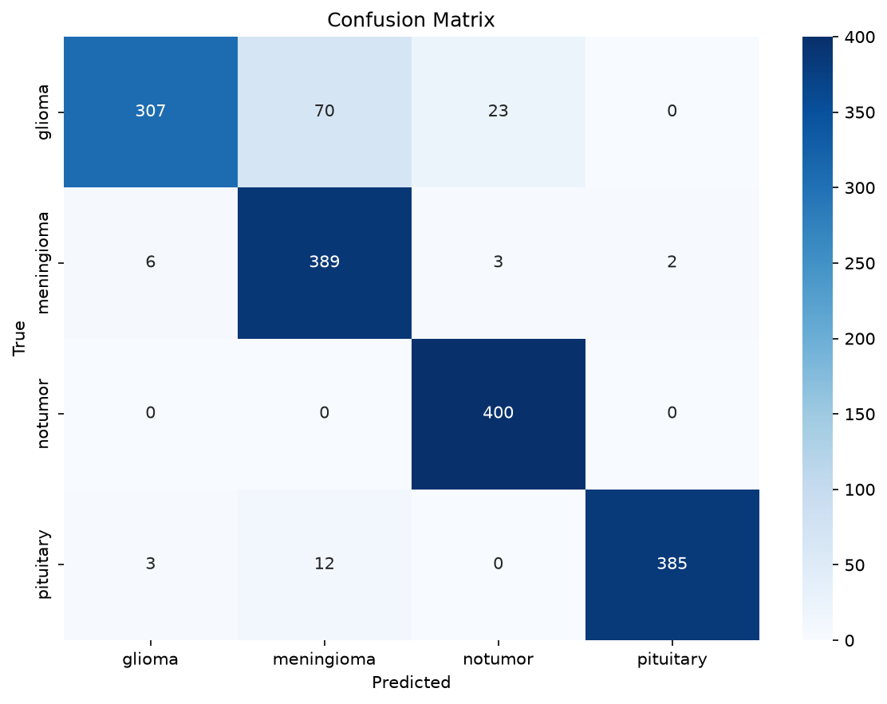
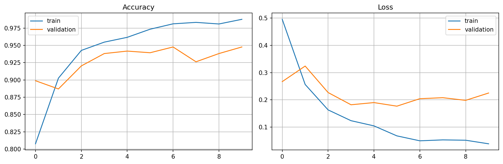

<div align="center">

# 🧠 Brain Tumor MRI Classifier

### Deep Transfer Learning with VGG16 for 4-Class Intracranial Tumor Detection

[](https://www.python.org/downloads/)
[](LICENSE)
[](https://www.tensorflow.org/)
[-brightgreen.svg)](tests/)
[](#performance-metrics)
[](https://github.com/psf/black)

[📄 Download Full Project PDF Report](Brain_Tumor_Classifier_Report.pdf) •
[Features](#features) •
[Quickstart](#quickstart-one-click-windows) •
[Architecture](#model-architecture) •
[Results](#performance-metrics) •
[CLI Usage](#cli-usage)

</div>

---

## 📌 Overview

Accurate, early detection of brain tumors from Magnetic Resonance Imaging (MRI) is vital for neurosurgical planning and oncological care. This repository provides a complete, modular, and reproducible deep learning pipeline that classifies axial brain MRI scans into four categories:

1. **Glioma** (primary intra-axial tumor)
2. **Meningioma** (extra-axial dural-based tumor)
3. **Pituitary Tumor** (sellar/suprasellar adenoma)
4. **No Tumor** (healthy anatomical control)

The system leverages **VGG16 transfer learning** with ImageNet initialization, unfreezing deep convolutional layers in Block 5 (`block5_conv1`, `block5_conv2`, `block5_conv3`) for domain-specific feature adaptation.

---

## ✨ Features

- ⚡ **One-Click Windows Setup**: Automatic virtual environment creation (`setup.bat`), inference (`predict.bat`), training (`train.bat`), and evaluation (`evaluate.bat`).
- 🏗️ **Modular Architecture**: Clean decoupling between data streaming, model building, training loops, evaluation, and single-image inference.
- 🚫 **Zero Data Leakage**: Training augmentations (brightness/contrast jitter) are applied strictly during training. Validation and test sets are never augmented.
- 🎯 **Single Source of Truth (SSOT)**: Class ordering is alphabetically canonicalized (`discover_class_names`), ensuring consistent label encodings across plotting, metrics, and inference.
- 📊 **Comprehensive Metrics**: Classification report (Precision, Recall, F1), per-class ROC-AUC, macro ROC-AUC, normalized confusion matrix, and training loss/accuracy curves.
- 🧪 **100% Tested**: 25 automated pytest unit tests covering data splitting, augmentation mathematics, architecture shape invariants, layer freezing, and inference packaging.
- 📄 **Full Technical Report Included**: Complete PDF report ([`Brain_Tumor_Classifier_Report.pdf`](Brain_Tumor_Classifier_Report.pdf)) with architecture diagrams, pathology descriptions, and clinical roadmaps.

---

## 🚀 Quickstart (One-Click Windows)

If you are on Windows, you can execute the entire pipeline with double-click batch files:

| Action | Script | Description |
| :--- | :--- | :--- |
| **1. Setup Environment** | `setup.bat` | Creates Python 3.11 `venv`, installs TensorFlow, Keras, and dependencies. |
| **2. Instant Prediction** | `predict.bat` | Runs inference on an MRI image (press **Enter** to test the bundled sample). |
| **3. Train Model** | `train.bat` | Trains VGG16 model on `data/raw/Training/` with checkpointing. |
| **4. Evaluate Model** | `evaluate.bat` | Evaluates accuracy & ROC-AUC on `data/raw/Testing/` (1,600 test images). |

---

## 💻 CLI Usage (PowerShell / Linux / macOS)

### 1. Environment Setup

```bash
# Clone the repository
git clone https://github.com/tribhu05/Brain-tumor-classifier.git
cd brain-tumor-classifier

# Create and activate Python 3.11 virtual environment
py -3.11 -m venv venv
# Windows:
.\venv\Scripts\Activate.ps1
# Linux/macOS:
source venv/bin/activate

# Install dependencies and editable package
pip install -r requirements.txt
pip install -e .
```

### 2. Predict on a Single MRI Image

```bash
python scripts/predict.py --image data/sample/sample_mri.jpg
```

**Output:**
```text
Prediction Result:
========================================
Status: Tumor: meningioma
Confidence: 100.00%

Per-class probabilities:
    meningioma: 100.00%
        glioma:  0.00%
     pituitary:  0.00%
       notumor:  0.00%
========================================
```

### 3. Train on Full Dataset

```bash
# Train using configs/config.yaml defaults (10 epochs, batch size 20)
python scripts/train.py --config configs/config.yaml

# (Optional) Override epochs or batch size from CLI:
python scripts/train.py --epochs 15 --batch-size 32
```

### 4. Evaluate Held-Out Test Set

```bash
python scripts/evaluate.py --config configs/config.yaml
```

### 5. Run Test Suite

```bash
pytest tests
```

---

## 📊 Dataset Structure

The pipeline is verified on **7,200 axial MRI scans** (5,600 training, 1,600 testing):

```
data/
├── raw/
│   ├── Training/
│   │   ├── glioma/      (1,400 images)
│   │   ├── meningioma/  (1,400 images)
│   │   ├── notumor/     (1,400 images)
│   │   └── pituitary/   (1,400 images)
│   └── Testing/
│       ├── glioma/      (400 images)
│       ├── meningioma/  (400 images)
│       ├── notumor/     (400 images)
│       └── pituitary/   (400 images)
└── sample/
    └── sample_mri.jpg   (Sample test MRI scan)
```

---

## 🧠 Model Architecture

```text
Input Image (128×128×3)
      │
      ▼
VGG16 Backbone (ImageNet Pretrained Weights)
  ├── Block 1–4 (Frozen, 7.89M Parameters)
  └── Block 5 (Trainable Fine-Tuning: block5_conv1, conv2, conv3 — 7.08M Params)
      │
      ▼
Flatten (8,192 features)
      │
      ▼
Dropout (Rate = 0.3)
      │
      ▼
Dense (128 units, ReLU activation — 1.05M Parameters)
      │
      ▼
Dropout (Rate = 0.2)
      │
      ▼
Dense Output (4 units, Softmax activation) ──► [Glioma, Meningioma, No Tumor, Pituitary]
```

- **Total Parameters:** 15,027,524
- **Trainable Parameters:** 7,133,060
- **Loss Function:** Sparse Categorical Crossentropy
- **Optimizer:** Adam ($\text{lr} = 1\times 10^{-4}$)

---

## 📈 Performance Metrics

Evaluated on **1,600 held-out test images** (400 per class), never seen during training or validation:

| Tumor Class | Precision | Recall (Sensitivity) | F1-Score | Per-Class ROC-AUC | Test Support |
| :--- | :---: | :---: | :---: | :---: | :---: |
| **Glioma** | 0.97 | 0.77 | 0.86 | **0.9429** | 400 |
| **Meningioma** | 0.83 | 0.97 | 0.89 | **0.9841** | 400 |
| **No Tumor** | 0.94 | 1.00 | 0.97 | **0.9989** | 400 |
| **Pituitary** | 0.99 | 0.96 | 0.98 | **0.9991** | 400 |
| **Macro Average** | **0.93** | **0.93** | **0.92** | **0.9812** | **1,600** |

- **Macro ROC-AUC:** **98.12%**
- **Peak Validation Accuracy:** **96.31%** (Epoch 10)
- **Final Training Accuracy:** **98.87%** (Loss: 0.0328)

<div align="center">

| Normalized Confusion Matrix (Test Set) | Training & Validation Curves |
| :---: | :---: |
|  |  |

</div>

---

## 📁 Repository Structure

```
brain-tumor-classifier/
├── Brain_Tumor_Classifier_Report.pdf  # Comprehensive Project Technical Report
├── README.md                          # Project Documentation
├── setup.bat                          # One-Click Environment Setup
├── predict.bat                        # One-Click MRI Scan Prediction
├── train.bat                          # One-Click Model Training
├── evaluate.bat                       # One-Click Model Evaluation
├── configs/
│   └── config.yaml                   # Typed configuration & hyperparameters
├── data/
│   ├── raw/ (Training & Testing)     # 7,200 MRI Scans
│   └── sample/                       # Demo scan for testing
├── assets/                            # Pre-trained model & evaluation plots
│   ├── best_model.keras              # Pre-trained fine-tuned model (Epoch 10)
│   ├── confusion_matrix.png          # Test set confusion matrix
│   ├── training_history.png          # Training curves plot
│   └── training_history.csv          # Per-epoch metric history
├── src/brain_tumor_classifier/        # Core Python Package
│   ├── config.py                     # Dataclass configurations
│   ├── data/                         # tf.data streaming & augmentation
│   ├── models/                       # VGG16 architecture definition
│   ├── training/                     # Training loop & callbacks
│   ├── evaluation/                   # Metrics, ROC-AUC, classification report
│   ├── inference/                    # Single-image prediction pipeline
│   └── visualization/                # Plotting utilities
├── scripts/
│   ├── train.py                      # CLI training entrypoint
│   ├── evaluate.py                   # CLI evaluation entrypoint
│   ├── predict.py                    # CLI prediction entrypoint
│   └── generate_pdf_report.py        # PDF report generator
└── tests/                            # Automated Pytest Suite (25 Tests)
```

---

## 📄 Full PDF Report

A complete, publication-style technical report has been compiled and included in the repository:
- **File:** [`Brain_Tumor_Classifier_Report.pdf`](Brain_Tumor_Classifier_Report.pdf)
- **Contents:** Executive Summary, Pathology Profiles, Dataset Distribution, VGG16 Architecture Deep-Dive, Quantitative Evaluation, Visual Artifacts, Software Engineering Refactoring, and Clinical Roadmap.

To re-generate the PDF report:
```bash
python scripts/generate_pdf_report.py
```

---

## ⚖️ License & Disclaimer

- **License:** Distributed under the [MIT License](LICENSE).
- **Disclaimer:** *This repository is developed for scientific research and educational benchmarking. It is not an FDA-approved medical device and must not be used as a primary diagnostic tool in clinical workflows.*

