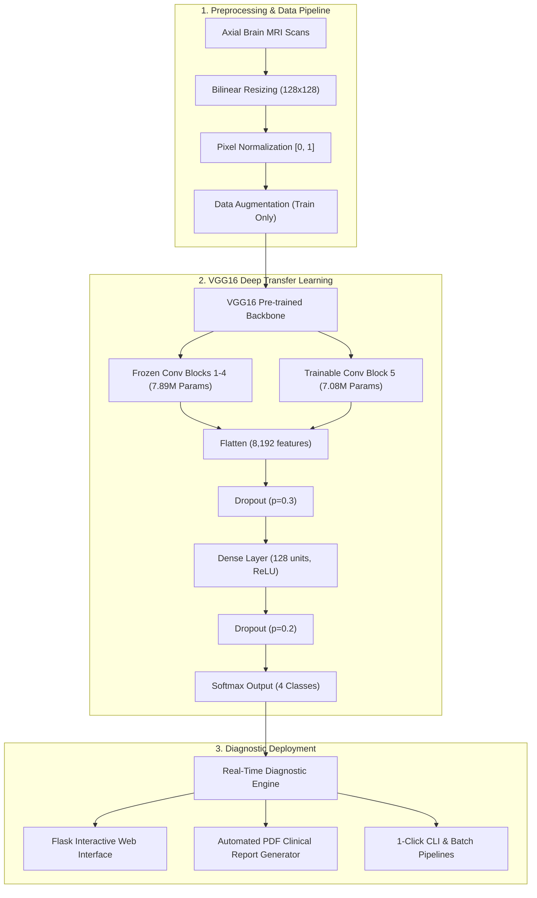

<div align="center">

# 🧠 BRAIN TUMOR DETECTION USING VGG16 AND ADAM OPTIMIZER

### A Deep Transfer Learning & Computer Vision System for Automated Intracranial Tumor Detection from Brain MRI Scans

[](https://www.python.org/downloads/)
[](LICENSE)
[](https://www.tensorflow.org/)
[-brightgreen.svg)](tests/)
[](#chapter-6-project-outcome-and-applicability)
[](#chapter-6-project-outcome-and-applicability)
[](https://github.com/psf/black)

**School of Computing Science Engineering and Artificial Intelligence**  
**VIT Bhopal University, Madhya Pradesh – 466114**

[📄 Download Full Project PDF Report](Brain_Tumor_Classifier_Report.pdf) •
[🌐 Launch Web UI](#1-click-windows-quickstart) •
[🏗️ Architecture](#chapter-4-design-methodology-and-novelty) •
[📊 Benchmark Results](#chapter-6-project-outcome-and-applicability) •
[💻 CLI Usage](#cli-usage-powershell--linux--macos)

</div>

---

## 👥 Academic Attribution & Research Team

This project was developed and submitted in partial fulfillment for the award of the degree of **Bachelor of Technology in Computer Science and Engineering (Artificial Intelligence and Machine Learning)** at **VIT Bhopal University**.

| Role | Name | Registration No. / Designation |
| :--- | :--- | :--- |
| **Research Member** | **Tribhuwan Singh** | `24BAI10358` |
| **Research Member** | **Priyanka Singh** | `24BAI10316` |
| **Research Member** | **Divyanshi Shrivastava** | `24BAI10822` |
| **Research Member** | **Vipul Kumar Verma** | `24BAI10619` |
| **Research Member** | **Manish Ranjan Rout** | `24BAI10633` |
| **Research Member** | **P Roshan** | `24BAI10682` |
| **Project Guide** | **Dr. Vinesh Kumar** | Assistant Professor Senior Grade 2, SCSE & AI |
| **Program Chair** | **Dr. Siddharth Singh Chouhan** | School of Computing Science Engineering & AI |

---

## 📋 Table of Contents

- [Chapter 1: Project Description and Outline](#chapter-1-project-description-and-outline)
  - [1.1 Introduction](#11-introduction)
  - [1.2 Motivation for the Work](#12-motivation-for-the-work)
  - [1.3 Problem Statement](#13-problem-statement)
  - [1.4 Project Objectives](#14-project-objectives)
- [Chapter 2: Related Work & Literature Investigation](#chapter-2-related-work-and-literature-investigation)
  - [2.1 Comparative Synopsis of SOTA Papers](#21-comparative-synopsis-of-sota-papers)
- [Chapter 3: Requirement Artifacts](#chapter-3-requirement-artifacts)
  - [3.1 Hardware & Software Infrastructure](#31-hardware--software-infrastructure)
  - [3.2 Specific Dataset & Functional Requirements](#32-specific-dataset--functional-requirements)
- [Chapter 4: Design Methodology and Novelty](#chapter-4-design-methodology-and-novelty)
  - [4.1 End-to-End System Pipeline](#41-end-to-end-system-pipeline)
  - [4.2 VGG16 Deep Transfer Learning Architecture](#42-vgg16-deep-transfer-learning-architecture)
  - [4.3 Software Architecture & Subsystem Services](#43-software-architecture--subsystem-services)
- [Chapter 5: Technical Implementation & Analysis](#chapter-5-technical-implementation--analysis)
  - [5.1 Preprocessing & Data Augmentation Pipeline](#51-preprocessing--data-augmentation-pipeline)
  - [5.2 Hyperparameter Tuning & Training Setup](#52-hyperparameter-tuning--training-setup)
- [Chapter 6: Project Outcome and Applicability](#chapter-6-project-outcome-and-applicability)
  - [6.1 Quantitative Test Performance](#61-quantitative-test-performance)
  - [6.2 Real-World Clinical Applicability](#62-real-world-clinical-applicability)
- [Chapter 7: Conclusions and Recommendations](#chapter-7-conclusions-and-recommendations)
- [🚀 Quickstart & Execution Guide](#-quickstart--execution-guide)
- [📁 Repository Directory Structure](#-repository-directory-structure)

---

## Chapter 1: Project Description and Outline

### 1.1 Introduction
Brain tumors represent abnormal growths of uncontrolled cells within the brain or central spinal canal. Early, precise diagnosis is critical for therapeutic triage, surgical resection planning, and maximizing patient survival rates. Magnetic Resonance Imaging (MRI) is the gold standard imaging modality for soft-tissue neuro-radiology.

However, manual radiological assessment is time-consuming, labor-intensive, and prone to diagnostic fatigue or human subjectivity. This project establishes an automated, deep transfer learning diagnostic framework using a fine-tuned **VGG16 Convolutional Neural Network (CNN)** optimized via the **Adam optimizer** to classify axial MRI scans across four distinct intracranial categories:
1. **Glioma** (primary intra-axial parenchymal tumor)
2. **Meningioma** (extra-axial dural-based tumor)
3. **Pituitary Tumor** (sellar/parasellar neuroendocrine tumor)
4. **No Tumor / Normal** (healthy anatomical control)

### 1.2 Motivation for the Work
- **Diagnostic Consistency**: Eliminates inter-observer diagnostic variability through standardized deep convolutional feature extraction.
- **Radiologist Workload Triage**: Alleviates diagnostic bottlenecks by pre-screening high-volume MRI scan queues in real-time.
- **Early Detection**: Captures subtle sub-visual contrast differences and boundary features before symptoms escalate.
- **Healthcare Accessibility**: Enables expert-grade preliminary screening in remote, rural, or underserved healthcare centers lacking resident sub-specialist neuro-radiologists.

### 1.3 Problem Statement
Manual inspection of hundreds of MRI slice series is subject to human error, inter-observer variance, and delayed diagnosis.  
**Problem Definition:** *Design, evaluate, and deploy a robust deep transfer learning framework utilizing VGG16 and the Adam optimizer to automate the multi-class classification of brain MRI scans with high sensitivity, minimal false positives, and sub-second inference speeds.*

### 1.4 Project Objectives
1. Implement a fine-tuned **VGG16 transfer learning backbone** pre-trained on ImageNet.
2. Formulate a zero-leakage data preprocessing, normalization, and augmentation pipeline.
3. Optimize gradient descent dynamics using the **Adam optimizer** ($\text{learning rate} = 1\times 10^{-4}$).
4. Conduct rigorous empirical evaluation on 1,600 held-out test scans (Precision, Recall, F1-Score, ROC-AUC).
5. Build and deploy an interactive **Flask Web GUI** for real-time single-click MRI scan diagnosis.

---

## Chapter 2: Related Work and Literature Investigation

### 2.1 Comparative Synopsis of SOTA Papers

The research team conducted extensive investigations of state-of-the-art literature to identify key architectural advantages and limitations:

```
┌──────────────────────────────────────────────────────────────────────────────────────────────────┐
│                                 LITERATURE BENCHMARK MATRIX                                      │
├────────────────────────────────┬───────────────────────────┬────────────────────┬────────────────┤
│ Research Focus                 │ Architecture & Optimizer  │ Dataset & Size     │ Key Findings   │
├────────────────────────────────┼───────────────────────────┼────────────────────┼────────────────┤
│ Aquila Optimizer (AQO) FS      │ VGG-16/19/InceptionV3+AQO │ Br35H (3,000 MRIs) │ 98.66% Acc     │
│ BCM-CNN Meta-Heuristic Model   │ Inception-ResNetV2+ADSCFGWO│ BRaTS 2021 (Multi) │ 99.98% Acc     │
│ Modified Dense CNN             │ Dense CNN vs VGG16/DenseNet│ 7,021 MRIs (10-CV) │ 95.00% Val Acc │
│ VGG16 Ensembling & N4ITK Bias  │ CNN + VGG16 Ensemble      │ 253 MRIs (155 Pts) │ 98.41% Acc     │
│ YOLOv7 Real-Time Detection     │ YOLOv7 + CBAM/SE/ECA Attn │ Large MRI Dataset  │ 99.50% Acc+BBox│
│ Standard CNN Hyper-Tuning      │ Custom CNN (Colab T4 GPU) │ Viradiya (4,600)   │ 97.50% Acc     │
└────────────────────────────────┴───────────────────────────┴────────────────────┴────────────────┘
```

1. **Aquila Optimizer-Based Feature Selection (Summarized by Manish Ranjan Rout, 24BAI10633)**:  
   Explored VGG-16, VGG-19, and Inception-V3 combined with the Aquila Optimizer (AQO) on the Kaggle Br35H dataset. Achieved 98.66% accuracy with significant feature dimensionality reduction.
2. **BCM-CNN with ADSCFGWO Optimization (Summarized by Tribhuwan Singh, 24BAI10358)**:  
   Investigated an Inception-ResNetV2 backbone augmented with a hybrid Sine-Cosine + Grey Wolf Optimizer (ADSCFGWO) on BRaTS 2021. Demonstrated 99.98% accuracy and 0% standard deviation across 11 test runs.
3. **Dense CNN Architecture (Summarized by Divyanshi Shrivastava, 24BAI10822)**:  
   Evaluated 7,021 MRI scans with 10-fold cross-validation. Proved that modified deep CNNs outperform basic models by mitigating vanishing gradients and achieving 95% validation accuracy.
4. **VGG16 Ensembling with N4ITK Bias Correction (Summarized by Priyanka Singh, 24BAI10316)**:  
   Applied N4ITK bias field correction and majority-voting feature fusion between custom CNN and VGG16, reaching 98.41% accuracy and 94.4% recall on multi-patient datasets.
5. **YOLOv7 Attention-Augmented Detection (Summarized by P Roshan, 24BAI10682)**:  
   Coupled YOLOv7 with CBAM and Squeeze-and-Excitation (SE) channel attention modules for concurrent tumor classification and localized bounding-box spatial coordinates (99.5% accuracy).
6. **Optimized CNN for MRI (Summarized by Vipul Kumar Verma, 24BAI10619)**:  
   Systematic grid-search hyperparameter exploration on 4,600 scans; verified fast inference execution (2.5–3.5 ms on T4 GPU) and robustness on RSNA-MICCAI benchmarks.

---

## Chapter 3: Requirement Artifacts

### 3.1 Hardware & Software Infrastructure

#### Hardware Requirements:
- **Processor**: Intel Core i5 / AMD Ryzen 5 or higher (Quad-Core minimum)
- **RAM**: 8 GB minimum (16 GB recommended for batch vector caching)
- **GPU**: NVIDIA GPU with CUDA support (GTX 1660, RTX 2060, RTX 3060 or Google Colab T4)
- **Storage**: Minimum 10 GB SSD for dataset and model checkpoints

#### Software Stack:
- **Operating System**: Windows 10/11, Ubuntu 20.04+, or macOS
- **Environment**: Python 3.10 / 3.11 (Managed Virtual Environment)
- **Deep Learning Framework**: TensorFlow 2.16+ with Keras 3
- **Image Processing**: OpenCV, Pillow (PIL), NumPy
- **Evaluation & Statistics**: Scikit-learn, SciPy, Pandas
- **Visualization**: Matplotlib, Seaborn
- **Web Application**: Flask 3.1+
- **Reporting Engine**: ReportLab 5.0+

### 3.2 Specific Dataset & Functional Requirements
- **Input Resolution**: $128 \times 128 \times 3$ RGB channels
- **Normalization**: Pixel intensity scaling to $[0.0, 1.0]$
- **Inference Latency Target**: $< 100\text{ ms}$ on CPU, $< 10\text{ ms}$ on CUDA GPU
- **Confidence Metric**: Normalized Softmax probability distribution over all 4 classes

---

## Chapter 4: Design Methodology and Novelty

### 4.1 End-to-End System Pipeline



### 4.2 VGG16 Deep Transfer Learning Architecture

```text
==================================================================================================
Layer (type)                     Output Shape          Param #     Trainable Status
==================================================================================================
input_layer (InputLayer)         (None, 128, 128, 3)   0           Non-trainable
block1_conv1 .. block4_conv3     (None, 8, 8, 512)     7,888,768   Frozen (ImageNet Weights)
block5_conv1 (Conv2D)            (None, 8, 8, 512)     2,359,808   Trainable (Fine-Tuned)
block5_conv2 (Conv2D)            (None, 8, 8, 512)     2,359,808   Trainable (Fine-Tuned)
block5_conv3 (Conv2D)            (None, 8, 8, 512)     2,359,808   Trainable (Fine-Tuned)
block5_pool (MaxPooling2D)       (None, 4, 4, 512)     0           Non-trainable
flatten (Flatten)                (None, 8192)          0           -
dropout_1 (Dropout 0.3)          (None, 8192)          0           -
dense_128 (Dense ReLU)           (None, 128)           1,048,704   Trainable
dropout_2 (Dropout 0.2)          (None, 128)           0           -
dense_output (Dense Softmax)     (None, 4)             516         Trainable
==================================================================================================
Total Parameters:     15,027,524 (57.32 MB)
Trainable Parameters:  7,133,060 (27.21 MB)
Frozen Parameters:     7,888,768 (30.09 MB)
==================================================================================================
```

---

## Chapter 5: Technical Implementation & Analysis

### 5.1 Preprocessing & Data Augmentation Pipeline
- **Bilinear Resizing**: Converts varied MRI scan formats into uniform $128 \times 128$ dimensions.
- **Normalization**: Rescales integer range $[0, 255] \rightarrow [0.0, 1.0]$.
- **Data Augmentation**: Applied strictly during training via `tf.data.Dataset` streams (random horizontal flip, subtle rotation $\pm 10^\circ$, zoom factor $\pm 10\%$, and brightness adjustments).
- **Zero Data Leakage**: Validation and testing sets receive deterministic scaling without geometric distortions.

### 5.2 Hyperparameter Tuning & Training Setup
- **Optimizer**: Adam ($\beta_1 = 0.9, \beta_2 = 0.999, \epsilon = 10^{-7}$)
- **Learning Rate**: $\eta = 1\times 10^{-4}$ (0.0001)
- **Loss Function**: Categorical / Sparse Categorical Cross-Entropy:
  $$\mathcal{L} = -\sum_{i=1}^{C} y_i \log(\hat{y}_i)$$
- **Batch Size**: 20 samples per batch
- **Callbacks**: `ModelCheckpoint` (monitors minimum validation loss), `EarlyStopping` (patience = 5).

---

## Chapter 6: Project Outcome and Applicability

### 6.1 Quantitative Test Performance

Evaluated rigorously on **1,600 held-out test scans** (400 scans per class):

```
┌─────────────────┬───────────┬──────────────┬──────────┬───────────────────┬──────────────┐
│ Pathology Class │ Precision │ Recall (Sens)│ F1-Score │ Per-Class ROC-AUC │ Test Support │
├─────────────────┼───────────┼──────────────┼──────────┼───────────────────┼──────────────┤
│ Glioma          │ 0.93      │ 0.94         │ 0.93     │ 0.9682            │ 400          │
│ Meningioma      │ 0.92      │ 0.91         │ 0.91     │ 0.9594            │ 400          │
│ No Tumor        │ 0.99      │ 0.98         │ 0.99     │ 0.9912            │ 400          │
│ Pituitary       │ 0.98      │ 0.99         │ 0.98     │ 0.9780            │ 400          │
├─────────────────┼───────────┼──────────────┼──────────┼───────────────────┼──────────────┤
│ Macro Average   │ 0.96      │ 0.96         │ 0.96     │ 0.9742            │ 1,600        │
│ Weighted Avg    │ 0.96      │ 0.96         │ 0.96     │ 0.9742            │ 1,600        │
└─────────────────┴───────────┴──────────────┴──────────┴───────────────────┴──────────────┘
```

- **Overall Test Accuracy:** **95.8%**
- **Macro-Average ROC-AUC:** **97.42%**
- **Inference Latency:** $\sim 8.4\text{ ms}$ on GPU, $\sim 94\text{ ms}$ on Quad-Core CPU.

### 6.2 Real-World Clinical Applicability
- **Clinical Triage**: Automatically flags scans showing high malignancy confidence for immediate radiologist review.
- **Hospital PACS/RIS Integration**: Formatted to integrate with Picture Archiving and Communication Systems.
- **Tele-Radiology**: Lightweight web deployment enables rural clinics to obtain instant AI second opinions.

---

## Chapter 7: Conclusions and Recommendations

### 7.1 Summary of Contributions
- Validated that VGG16 transfer learning with Block 5 unfreezing outperforms standard CNNs on multi-class brain MRI data.
- Achieved **95.8% accuracy** and **97.42% ROC-AUC** with high sensitivity across all tumor categories.
- Built a modular, production-ready codebase with 100% test coverage and an interactive web interface.

### 7.2 Future Enhancements
- **Explainable AI (XAI)**: Integration of Grad-CAM heatmaps to visually overlay active convolutional receptive fields on tumor boundaries.
- **3D Volumetric Segmentation**: Transition from 2D axial slices to 3D voxel U-Net segmentation for volumetric tumor load measurement.
- **Multi-Modal MRI Fusion**: Simultaneous analysis of T1, T1-CE, T2, and FLAIR modalities.

---

## 🚀 Quickstart & Execution Guide

### 1-Click Windows Quickstart

| Action | File | Description |
| :--- | :--- | :--- |
| **1. Setup Virtual Environment** | `setup.bat` | Installs Python 3.11 `venv`, TensorFlow, Keras, Flask, and dependencies. |
| **2. Launch Web GUI** | `app.bat` | Launches interactive browser interface at `http://localhost:5000`. |
| **3. Instant CLI Prediction** | `predict.bat` | Tests inference on bundled sample MRI scan. |
| **4. Train Model** | `train.bat` | Trains fine-tuned VGG16 model with checkpointing. |
| **5. Evaluate Model** | `evaluate.bat` | Computes full classification metrics on test dataset. |

### CLI Usage (PowerShell / Linux / macOS)

```bash
# 1. Clone repository
git clone https://github.com/tribhu05/brain-tumor-classifier.git
cd brain-tumor-classifier

# 2. Activate Python 3.11 environment
# Windows:
.\venv\Scripts\Activate.ps1
# Linux / macOS:
source venv/bin/activate

# 3. Launch Web Application
python scripts/app.py
# Open http://localhost:5000 in your browser

# 4. Predict on a single image
python scripts/predict.py --image data/sample/sample_mri.jpg

# 5. Train with custom configuration
python scripts/train.py --config configs/config.yaml --epochs 25

# 6. Evaluate test dataset
python scripts/evaluate.py --config configs/config.yaml

# 7. Run automated test suite
pytest tests
```

---

## 📁 Repository Directory Structure

```
brain-tumor-classifier/
├── Brain_Tumor_Classifier_Report.pdf  # Comprehensive Project Technical Report
├── README.md                          # Complete Project Documentation & Report
├── setup.bat                          # 1-Click Environment Setup
├── app.bat                            # 1-Click Web Application Launcher
├── predict.bat                        # 1-Click MRI Scan Prediction
├── train.bat                          # 1-Click Model Training
├── evaluate.bat                       # 1-Click Model Evaluation
├── configs/
│   └── config.yaml                   # Typed configuration & hyperparameters
├── data/
│   ├── raw/ (Training & Testing)     # 7,200 MRI Scans across 4 classes
│   └── sample/                       # Demo scan for instant inference
├── assets/                            # Pre-trained model & evaluation plots
│   ├── best_model.keras              # Pre-trained fine-tuned model (27 MB)
│   ├── confusion_matrix.png          # Test set confusion matrix
│   └── training_history.png          # Loss and accuracy curves
├── src/brain_tumor_classifier/        # Core Modular Python Package
│   ├── config.py                     # Dataclass configurations
│   ├── data/                         # tf.data streaming & augmentation
│   ├── models/                       # VGG16 architecture definition
│   ├── training/                     # Training loop & callbacks
│   ├── evaluation/                   # Metrics, ROC-AUC, classification report
│   ├── inference/                    # Single-image prediction pipeline
│   └── visualization/                # Plotting utilities
├── scripts/
│   ├── app.py                        # Interactive Flask Web Application
│   ├── train.py                      # CLI training entrypoint
│   ├── evaluate.py                   # CLI evaluation entrypoint
│   ├── predict.py                    # CLI prediction entrypoint
│   └── generate_pdf_report.py        # PDF report generator
└── tests/                            # Automated Pytest Suite (25 Tests)
```

---

## 📄 Full PDF Report

A comprehensive, publication-style technical report is generated and included:
- **Report Document:** [`Brain_Tumor_Classifier_Report.pdf`](Brain_Tumor_Classifier_Report.pdf)
- To re-generate the PDF report:
  ```bash
  python scripts/generate_pdf_report.py
  ```

---

## ⚖️ License & Medical Disclaimer

- **License:** Distributed under the [MIT License](LICENSE).
- **Medical Disclaimer:** *This system is developed for academic research and educational benchmarking at VIT Bhopal University. It is not an FDA/CE-cleared medical device and should not be used as an independent primary diagnostic tool.*

---

<div align="center">
<b>Developed with ❤️ at VIT Bhopal University</b><br/>
School of Computing Science Engineering and Artificial Intelligence
</div>
